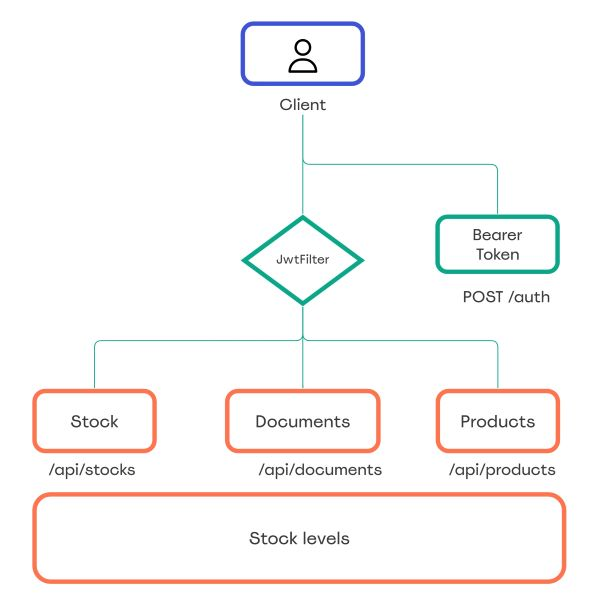

## Stock Manager
Stock manager is an api that manages stock levels. Change products quantity by creating distinct documents, create various independent stocks, restrict acess by authorisation with three roles: admin, user, viewer. Each document type has distinct impact on product quantity (e.g. Goods recieved - increase quantity, Dispatch note - reduce quantity, Inventory - set quantity)
  
Authorisation is based on Spring security and JWT Bearer Tokens.

## Architecture

## Endpoints

|    Endpoint    | Method |  Request  |   Response   |            Function            | Authorization |
|    --------    |-------- |--------  |--------   |            --------            |-------- |
| /auth          | POST   | JSON BODY | Bearer Token | authenticate user              | -             |
|/register | POST   | JSON BODY | -    | create new user               | -    |
| /api/products  | POST   | JSON BODY | JSON BODY    | add new product                | user, admin   |
| /api/products  | GET    | -         | JSON BODY    | get all products in main stock | -             |
| /api/products/{id}  | GET    | -         | JSON BODY    | get product by id |        -     |
| /api/products/{id}/stock  | GET    | -         | JSON BODY    | get all products in stock with given id | - |      
| /api/stock     | POST   | JSON BODY | JSON BODY    | add new stock                  | admin         |
| /api/documents | POST   | JSON BODY | JSON BODY    | add new document               | user,admin    |
|/api/documents/{id} | GET   | - | JSON BODY    | get document by id               | -    |
---------------------------------------------------------------------------------------------

## To use
Clone this repo

run docker compose up

first authorization:
username: admin
password: adminpass
